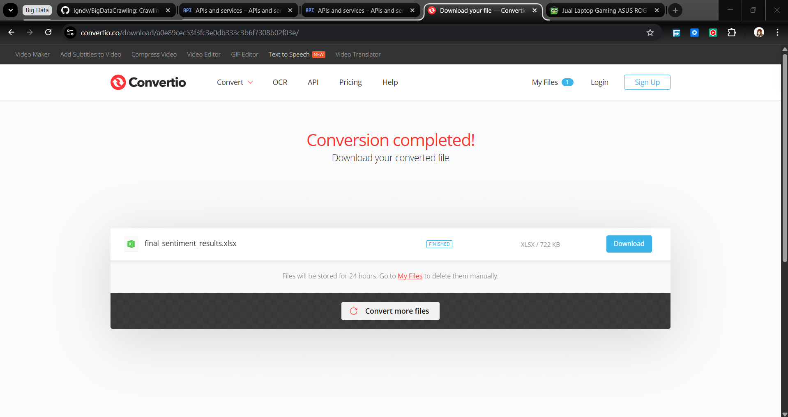
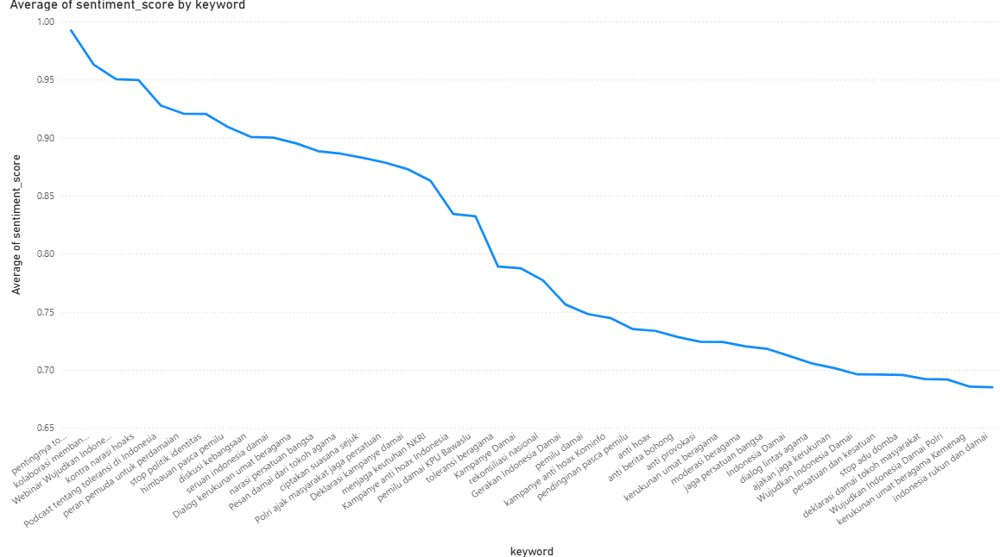

# Big Data By Ignasius Deva
# NRP : 5024231003

Topik : #WujudkanIndonesiaDamai

Metode : Crawling Data portal berita dengan BS4 dan Youtube dengan Youtube Data V3 API

Gerakan #WujudkanIndonesiaDamai adalah gerakan sosial yang lahir dari keprihatinan atas potensi perpecahan yang mengancam kehidupan berbangsa dan bernegara di Indonesia.
Tujuan utama dari gerakan #WujudkanIndonesiaDamai adalah untuk menekankan pentingnya menjaga kedamaian dalam menyuarakan aspirasi masyarakat dan mahasiswa dengan cara yang damai dan tanpa kekerasan. Gerakan ini bertujuan menciptakan suasana kondusif bagi dialog konstruktif mengenai berbagai isu sosial dan politik yang menjadi perhatian rakyat dan kaum muda. Melalui aksi damai, gerakan ini ingin mendorong reformasi, transparansi pemerintahan, dan penghormatan terhadap kebebasan berpendapat sekaligus menghindari bentrokan maupun kekerasan yang dapat merugikan semua pihak. Intinya, #WujudkanIndonesiaDamai berkomitmen untuk mewujudkan perubahan positif dengan cara yang harmonis demi masa depan Indonesia yang lebih adil dan damai.

--------------------------------------------------------------------------------------
### Keywords ### (Bisa di cek di keywords_config.py) :

Keywords Berita :

    # Kategori 1: Kata Kunci Utama
    "Wujudkan Indonesia Damai",
    "Indonesia Damai",
    "Kampanye Damai",
    "Gerakan Indonesia Damai",
    
    # Kategori 2: Persatuan dan Anti-Perpecahan
    "jaga persatuan bangsa",
    "persatuan dan kesatuan",
    "rekonsiliasi nasional",
    "anti provokasi",
    "stop adu domba",
    
    # Kategori 2: Toleransi dan Kerukunan
    "toleransi beragama",
    "kerukunan umat beragama",
    "dialog lintas agama",
    "moderasi beragama",
    
    # Kategori 2: Anti-Hoax dan Suasana Kondusif
    "anti hoax",
    "anti berita bohong",
    "ciptakan suasana sejuk",
    "pemilu damai",
    "pendinginan pasca pemilu",
    
    # Kategori 3: Kombinasi dengan Institusi
    "Wujudkan Indonesia Damai Polri",
    "kerukunan umat beragama Kemenag",
    "deklarasi damai tokoh masyarakat",
    "pemilu damai KPU Bawaslu",
    "kampanye anti hoax Kominfo"

Keywords Youtube :

    "Webinar Wujudkan Indonesia Damai",
    "Deklarasi kampanye damai",
    "Pesan damai dari tokoh agama",
    "Polri ajak masyarakat jaga persatuan",
    "Liputan berita Indonesia Damai",
    "Podcast tentang toleransi di Indonesia",
    "Dialog kerukunan umat beragama",
    "Kampanye anti hoax Indonesia",
--------------------------------------------------------------------------------------

1. Install to Run :
  The requirements.txt have all of the required dependencies to install

          pip install -r requirements.txt

  dependencies included : request, bs4, python-dotenv, google-api-python-client, pandas, torch, transformers, google-generativeai #On final Product, unused because I am using a local LLM

2. File and Folder Structure :
    Folders :
    - combined_data/                     -   Contains merged and final analysis results
      - combined_all_sources_cleaned.csv - All cleaned data from news + social media
      - final_sentiment_results.csv      - Final output with sentiment analysis
    
    - news_portal/                       - News scraping results
      - news_detik.csv                   - Raw scraped news from Detik
      - news_detik_cleaned.csv           - Gemini-cleaned summaries
    
    - social_media/                      - Social media scraping results
      - youtube.csv                      - Raw YouTube comments
      - youtube_cleaned.csv              - Gemini-cleaned comments
    
    Files:
    - .env                                 - Contains API keys and credentials (Instagram, YouTube API, Gemini API)
    - .gitignore                           - Prevents sensitive files from being committed to git
    - crawler_berita.py                    - Scrapes Detik news articles (title + content)
    - crawler_sosmedYT.py                  - Scrapes YouTube comments using API
    - csv_combiner.py                      - Merges all *_cleaned.csv files into one
    - indobert_process.py                  - Performs sentiment analysis (positive/neutral/negative)
    - keywords_config.py                   - Central configuration for keywords and scraping limits
   
    - gemini.py                            - Cleans and summarizes text using Gemini AI #Before update, because got limited by free tier API
    - localLLM.py                          - NEW : Cleans and summarizes text using --- AI #Before update, because got limited by free tier API
    
4. Workflow :
   - crawler_berita.py → news_portal/news_detik.csv
   - crawler_sosmedYT.py → social_media/youtube.csv

   - localLLM.py (previously gemini.py) → Processes both CSVs:
     - news_detik.csv → news_detik_cleaned.csv
     - youtube.csv → youtube_cleaned.csv

   - csv_combiner.py → Merges all *_cleaned.csv files:
     - combined_data/combined_all_sources_cleaned.csv

   - indobert_process.py → Sentiment analysis:
     - combined_data/final_sentiment_results.csv
    
   - Convert from csv to excel untuk mempermudah pengaksesan oleh tableu

   - dashboard and visualize data with tableu (browser)

5.  Process Visualization :
    1. Crawl Data Berita
       
       

       
    2. Crawl Sosmed Youtube

       

       
       
    3. Menggunakan LocalLLM yaitu google/gemma-3-12b untuk memberihkan dan merangkum data
       
       

       

       
       
    4. Combine CSV setelah clean dan dirangkum ke combined data from all source
       
       

    5. Dilakukan sentiment analysis oleh Indobert Model
        
        
       
    6. Convert from csv to excel from website (manually)
        
        
        
    7. Dashboard and visualize data with PowerBI
        
        
        
        

--------------------------------------------------------------------------------------

Hasil Data Dari Crawling Berita dan Sosmed Youtube :

    Data yang diperoleh based on Source

    Total Data : 1224 data
    Detik : 688 data (56,21%)
    Youtube : 536 data (43,79%)

Hasil Sentiment Analysis :

    Sentimen Netral: Sentimen netral merupakan yang paling dominan, dengan 481 kemunculan, menyumbang 39,30% dari total sentimen.

    Sentimen Positif: Sentimen positif berada di posisi kedua, dengan 407 kemunculan, atau 33,25% dari total.

    Sentimen Negatif: Sentimen negatif adalah yang paling sedikit, dengan 336 kemunculan, atau 27,45% dari total. 

Result : Mostly Positive And Neutral 

Secara umum, sentimen yang terdeteksi cenderung positif atau netral. Dengan nilai rata-rata sentiment_score sebesar 0.82 (dari skala 0 hingga 1), ini menunjukkan bahwa sebagian besar konten atau komentar yang dianalisis memiliki nuansa yang mendukung atau setidaknya tidak negatif terhadap topik perdamaian dan persatuan.
